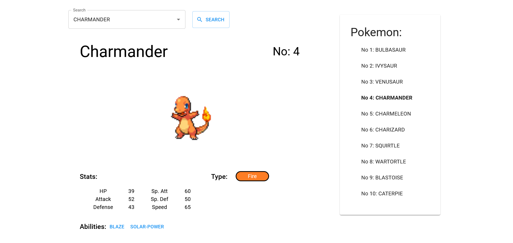
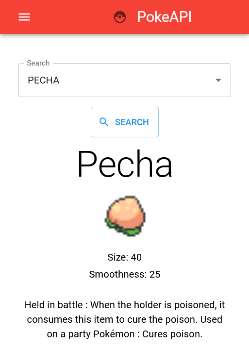

## PokemonAPI PokeDex

This is a website built using the PokeAPI. Users can look up information about the original 150 pokemon as well as all the different berries in the games. 

## Link

- Live Site - [PokeApi](https://jeff343.github.io/poke-api/)

## ScreenShot

# Built With

- React
- Material UI
- React Router

## Purpose

I started this project with the intent to learn how to incorporate a third party API into my website, and to learn how to allow the user to query the API. I also thought this would be a good opportunity to learn the MUI framework.

## Useful Resources

- [React Docs](https://beta.reactjs.org/)
- [MUI Docs](https://mui.com/)
- [PokeAPI](https://pokeapi.co/)

## Author

- github - [@jeff343](https://github.com/jeff343)